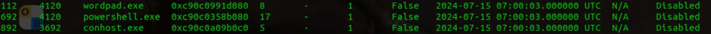
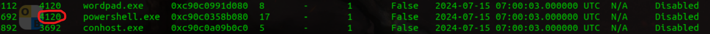
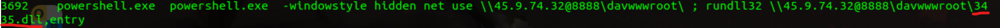
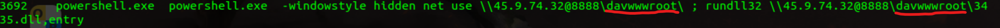
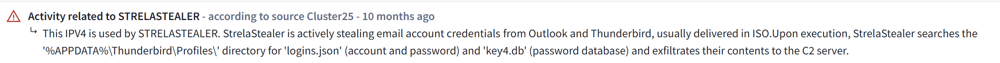

# Cyber Defender's "Reveal Lab" write-up.

## Scenario
"You are a forensic investigator at a financial institution, and your SIEM flagged unusual activity on a workstation with access to sensitive financial data. Suspecting a breach, you received a memory dump from the compromised machine. Your task is to analyze the memory for signs of compromise, trace the anomaly's origin, and assess its scope to contain the incident effectively."

## Question 1
### "Identifying the name of the malicious process helps in understanding the nature of the attack. What is the name of the malicious process?"

Command used:
sudo python3 vol.py -f mem.dmp windows.pslist

## Question 2
### "Knowing the parent process ID (PPID) of the malicious process aids in tracing the process hierarchy and understanding the attack flow. What is the parent PID of the malicious process?"

## Question 3
### "Determining the file name used by the malware for executing the second-stage payload is crucial for identifying subsequent malicious activities. What is the file name that the malware uses to execute the second-stage payload?"

Command used:
sudo python3 vol.py -f mem.dmp windows.cmdline

## Question 4
### "Identifying the shared directory on the remote server helps trace the resources targeted by the attacker. What is the name of the shared directory being accessed on the remote server?"

## Question 5
### "What is the MITRE ATT&CK sub-technique ID that describes the execution of a second-stage payload using a Windows utility to run the malicious file?"

[T1218.011](https://attack.mitre.org/techniques/T1218/011/)

## Question 6
### Identifying the username under which the malicious process runs helps in assessing the compromised account and its potential impact. What is the username that the malicious process runs under?

Command used:
sudo python3 vol.py -f mem.dmp getsids

## Question 7
### Knowing the name of the malware family is essential for correlating the attack with known threats and developing appropriate defenses. What is the name of the malware family?

https://www.virustotal.com/gui/ip-address/45.9.74.32
