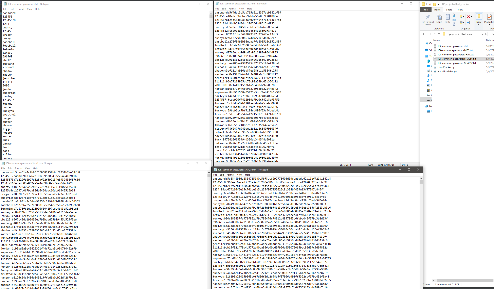
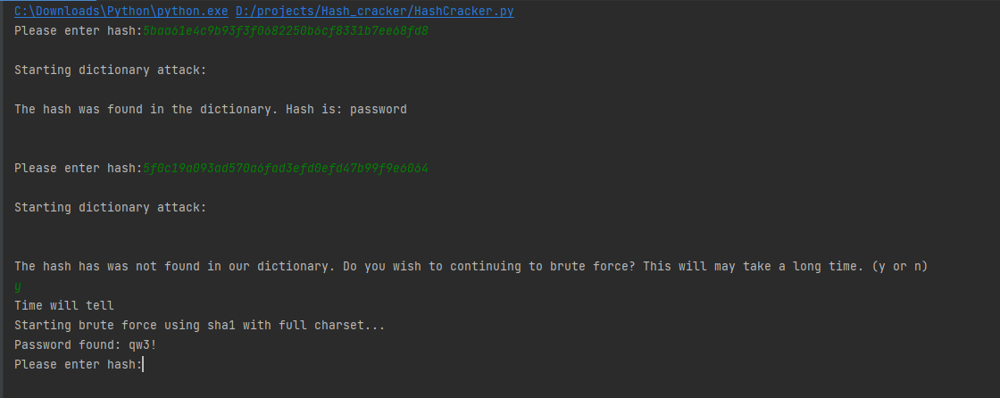
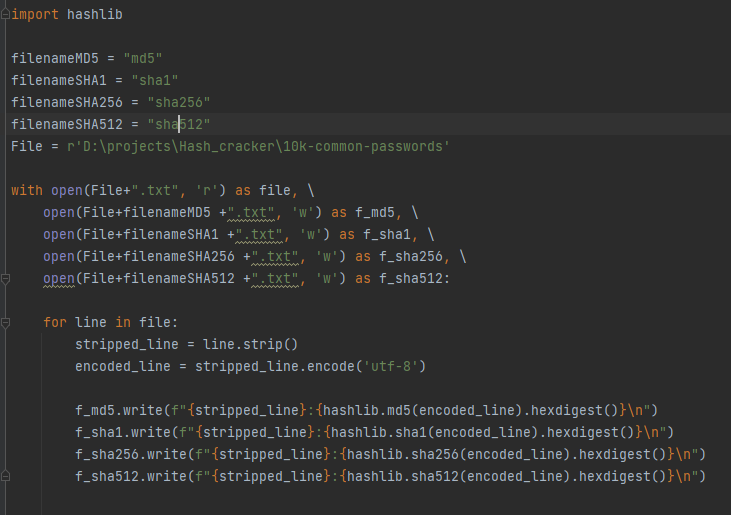
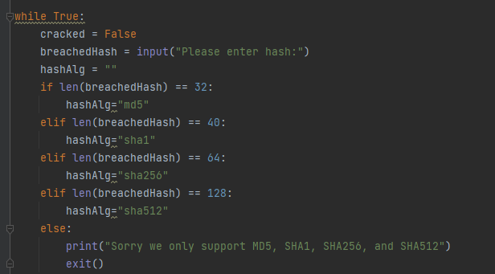
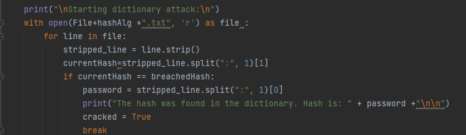
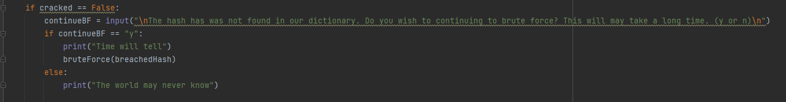
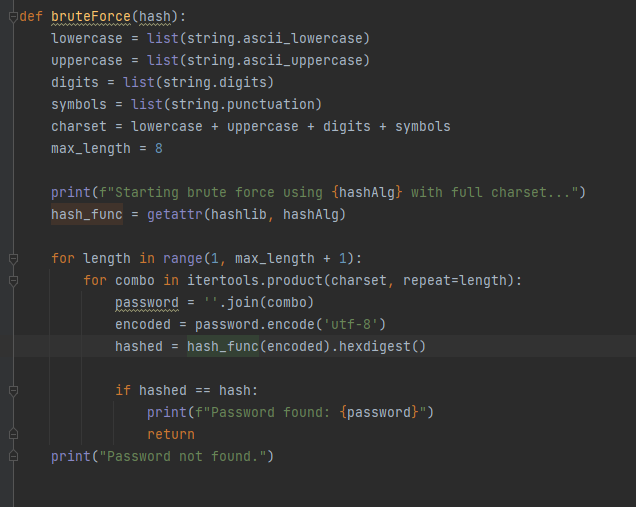

# Basic Hash Cracker
[Hash List Maker Source Code](./HashListMaker.py).

[Hash Cracker Source Code](./HashCracker.py).


### Resources used:

https://gist.github.com/richardkundl/b68afdcf68240dcff50a
https://docs.python.org/3/library/hashlib.html

https://docs.python.org/3/library/itertools.html

## What did I learn?
This project further reinforced the importance of complex/unique passwords. It showed me why rainbow table attacks are a common way passwords can be leaked. It also exposed me to two new Python libraries: hashlib and itertools.


## Screenshots of the program in action
 


## Brief Code Walk Through

The first step before I began the cracker was making a word list. I used the top 10,000 passwords (which can be swapped for rockyou.txt for wider coverage). The program would then open a new text file for each hashing algorithm I used, writing the password and the corresponding hash separated by ":" for future splitting.




The program would start by accepting the user's input. The length of the hash determines what algorithm was used.




Using the algorithm found in the previous step, we would access the respective updated password text file, comparing the user's input hash to the hashes in the file. If there was a match, then the program would tell the user and print out the corresponding password.




This part of the program would then prompt users to confirm whether they want to use the brute force function.




The brute force function created a character set to run through using itertools. For usability, I set a maximum password length to 8.




## Future Improvements

If I wanted to improve this project in the future, I would first consider adding a function that could handle salts. A second idea I could implement is adding mutations to my dictionary attack instead of just using bigger and bigger lists. This would also allow for a targeted attack against a specific user. The last thing I could do is improve the efficiency of the brute force option, either by using GPU acceleration or parallel processing.


```
