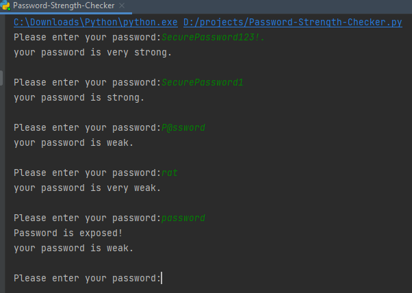
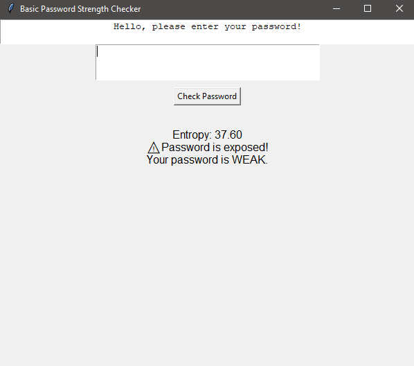
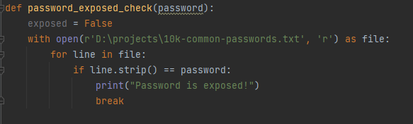
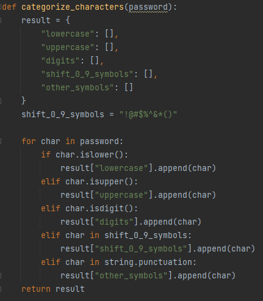
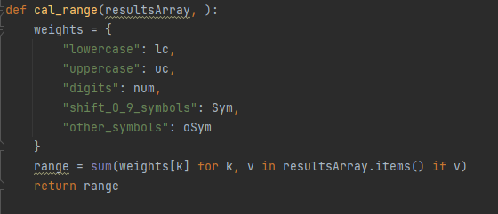
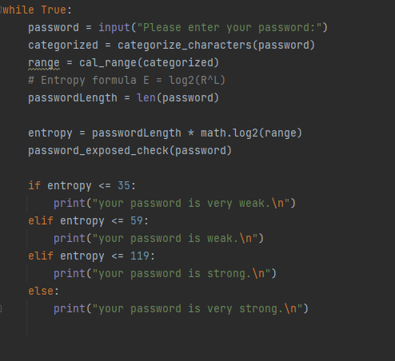
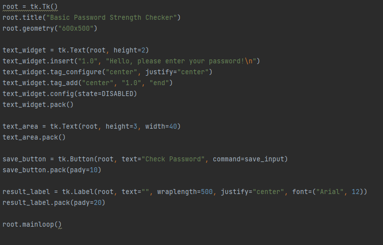

# Password Strength Checker
[Source Code without GUI](./Password-Strength-Checker.py).

[Source Code with UI](./UI-Password-Strength-Checker.py).

### Resources used:

https://docs.python.org/3/library/tk.html

https://gist.github.com/richardkundl/b68afdcf68240dcff50a

## What did I learn?
Creating a basic password strength tester reinforced many foundational programming and security concepts.

From a coding perspective, I reviewed how to manipulate strings to check things like length, the use of uppercase/lowercase letters, digits, and special characters. It also gave me hands-on practice with control flow (if/else statements).I broke the logic into functions to keep things clean and readable, and used basic data structures like arrays and sets where needed.

On the security side, I reviewed what makes a password strong, like the length, character variety, and avoiding common passwords. This also helped me realize the limitations of client-side password checkers; they can give guidance, but they don't guarantee security.

Building the password test was a solid mini-project. It touched on real-world relevance since password strength is something every app deals with. It gave me a refresher in Python and helped me learn the basics of the Tkinter package. Creating a basic password strength tester was a fun project that covered  skills across programming, security, and even user experience.


## Screenshots of the program in action
 

















## Brief Code Walk Through


> This is a blockquote following a header.
>
> When something is important enough, you do it even if the odds are not in your favor.

### Header 3

```js
// Javascript code with syntax highlighting.
var fun = function lang(l) {
  dateformat.i18n = require('./lang/' + l)
  return true;
}
```

```ruby
# Ruby code with syntax highlighting
GitHubPages::Dependencies.gems.each do |gem, version|
  s.add_dependency(gem, "= #{version}")
end
```

#### Header 4

*   This is an unordered list following a header.
*   This is an unordered list following a header.
*   This is an unordered list following a header.

##### Header 5

1.  This is an ordered list following a header.
2.  This is an ordered list following a header.
3.  This is an ordered list following a header.

###### Header 6

| head1        | head two          | three |
|:-------------|:------------------|:------|
| ok           | good swedish fish | nice  |
| out of stock | good and plenty   | nice  |
| ok           | good `oreos`      | hmm   |
| ok           | good `zoute` drop | yumm  |

### There's a horizontal rule below this.

* * *

### Here is an unordered list:

*   Item foo
*   Item bar
*   Item baz
*   Item zip

### And an ordered list:

1.  Item one
1.  Item two
1.  Item three
1.  Item four

### And a nested list:

- level 1 item
  - level 2 item
  - level 2 item
    - level 3 item
    - level 3 item
- level 1 item
  - level 2 item
  - level 2 item
  - level 2 item
- level 1 item
  - level 2 item
  - level 2 item
- level 1 item

### Small image


### Large image


### Definition lists can be used with HTML syntax.

<dl>
<dt>Name</dt>
<dd>Godzilla</dd>
<dt>Born</dt>
<dd>1952</dd>
<dt>Birthplace</dt>
<dd>Japan</dd>
<dt>Color</dt>
<dd>Green</dd>
</dl>

```
Long, single-line code blocks should not wrap. They should horizontally scroll if they are too long. This line should be long enough to demonstrate this.
```

```
The final element.
```
