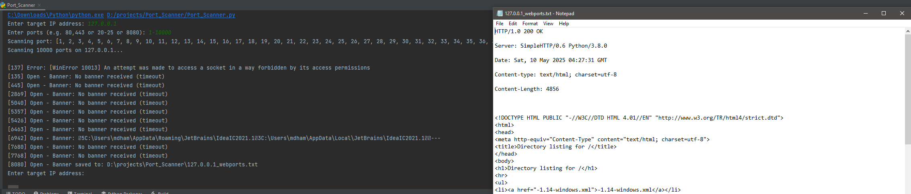
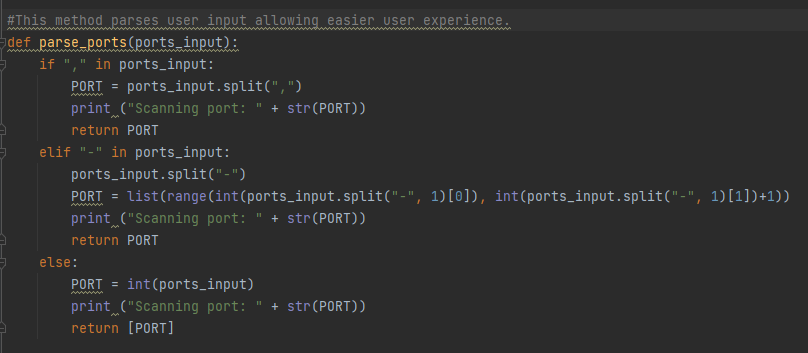
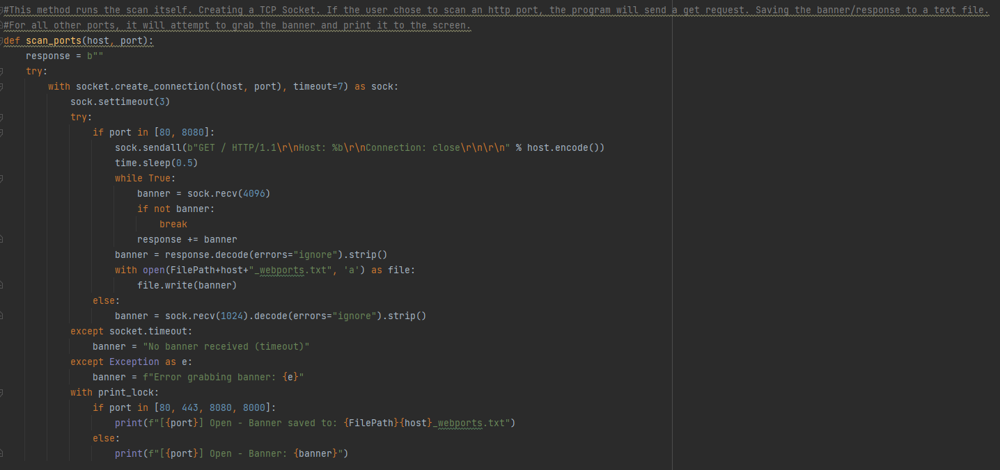
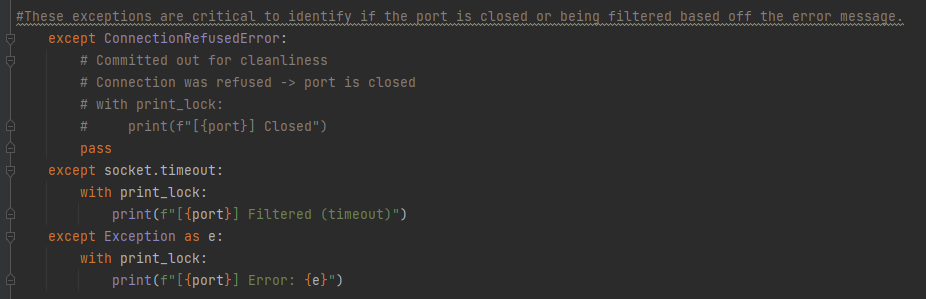
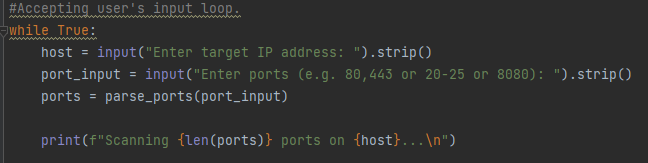
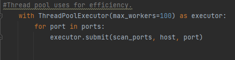

# Basic Password Strength Checker
[Source Code](./Port_Scanner.py).


### Resources used:

https://docs.python.org/3/library/socket.html
https://docs.python.org/3/library/concurrent.futures.html

https://docs.python.org/3/library/threading.html

## What did I learn?
This project gave me a better understanding of how port scanning generally works. Before this project, I had used nmap, but I did not realize how much work was being done in the background. For example, parsing out the banner results so a few clean lines. Making this project gave me a new appreciation for nmap.

From a coding perspective, this was my first time using Python's socket and threading libraries. The threading library significantly impacts and should not be forgotten in any lengthy runtime projects.

On the security side, this activity would fall under active reconnaissance; a good nmap or vulnscan is critical in any security assessment. This project shows me how banner grabbing works; the first response from any connection attempt is what the banner is.

 


## Screenshots of the program in action


## Brief Code Walk Through

The first part of the project involves organizing the user's input so the program knows what the target machine is and what ports to scan.




This method runs the scan itself, creating a TCP Socket. If the user chooses to scan an HTTP port, the program will send a GET request. The HTTP banner/response is saved to a text file.





These exceptions are critical to identifying whether the port is closed or being filtered based on the error message.




This is an Accepting user's input loop.




Using a Thread pool for efficiency.




## Future Improvements

If I wanted to improve this project in the future, I would first like to improve the program's usability, offering UDP scans, modification options of the speed of the scan, and maybe OS fingerprinting.


```
