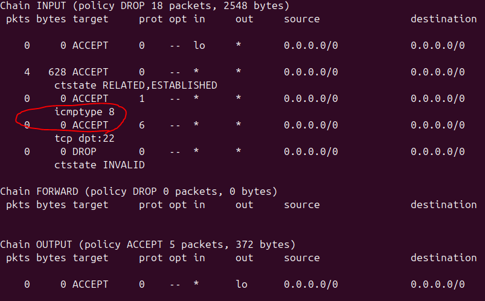
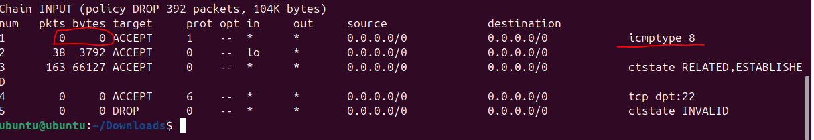
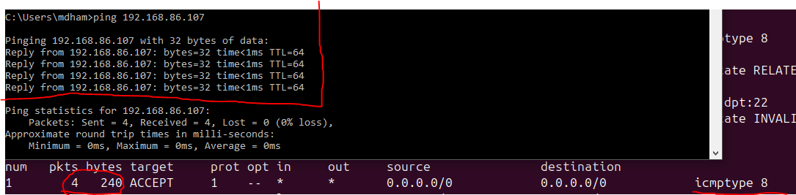
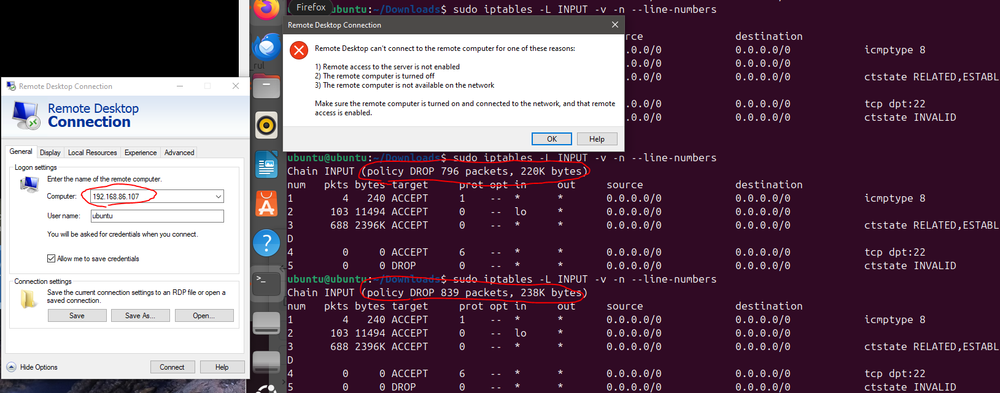
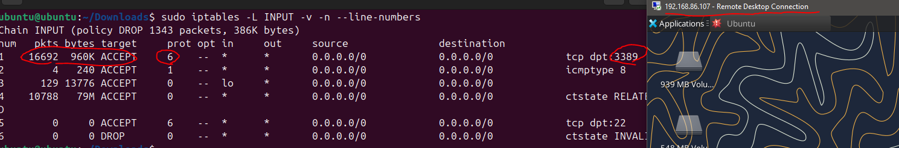

# Firewall-Rules-Simulation
[Desktop Rules](./desktop_rules.v4).

[DNS Server Rules](./dns_server_rules.v4).

[Web Server Rules](./web_server_rules.v4).

[Email Server Rules](./email_server.v4).


### Resources used:

https://linux.die.net/man/8/iptables

https://docs.xfce.org/xfce/getting-started

https://github.com/neutrinolabs/xrdp

## Why this project was important:

In the past, I have configured and troubleshooted firewall rules; however, using iptables allowed me to set up a firewall from scratch using the CLI. This project gave me a strong reminder about the importance of the order of the firewall rules. Going into the project, I knew that the order matters when the traffic action is different (Allow, Drop, etc), but I did not think about the importance of the order of the rules for logging purposes. This was apparent when I was testing ping on the device, and the packets would hit the "ctstate RELATED,ESTABLISHED" rule instead of the ICMP rule. This, in turn, hurt the logging capability of the firewall, causing me to put the  "ctstate RELATED,ESTABLISHED" rule at the bottom of the input rule list.


## Testing Rules:
As mentioned in the section above I found an issue with the order of my firewall rules which hurt the logging capability.

The first screenshot shows that no packets hit the ICMP rule event after the device was pinged.




After I moved the  "ctstate RELATED,ESTABLISHED" rule to the bottom of the list, we can see the logging working as intended.





I also wanted to verify that the policy deny all was working for the INPUT chain. I did this by attempting to RDP into the host. After confirming that I was getting blocked, I created an allow rule to verify that it could work.





```

### Default configuration:
Chain INPUT (policy ACCEPT)
target     prot opt source               destination         

Chain FORWARD (policy ACCEPT)
target     prot opt source               destination         

Chain OUTPUT (policy ACCEPT)
target     prot opt source               destination


###  Configuration for a home desktop: 
Chain INPUT (policy DROP)
target     prot opt source               destination         
ACCEPT     all  --  anywhere             anywhere            
ACCEPT     icmp --  anywhere             anywhere             icmp echo-request
ACCEPT     tcp  --  anywhere             anywhere             tcp dpt:ssh
DROP       all  --  anywhere             anywhere             ctstate INVALID
ACCEPT     all  --  anywhere             anywhere             ctstate RELATED,ESTABLISHED

Chain FORWARD (policy DROP)
target     prot opt source               destination         

Chain OUTPUT (policy ACCEPT)
target     prot opt source               destination         
ACCEPT     all  --  anywhere             anywhere   


###  Configuration for a web server:
Chain INPUT (policy DROP)
target     prot opt source               destination         
ACCEPT     all  --  anywhere             anywhere            
ACCEPT     udp  --  anywhere             anywhere             udp dpt:domain ctstate RELATED,ESTABLISHED
ACCEPT     tcp  --  anywhere             anywhere             tcp dpt:domain ctstate RELATED,ESTABLISHED
ACCEPT     tcp  --  anywhere             anywhere             tcp dpt:ssh ctstate RELATED,ESTABLISHED
ACCEPT     udp  --  192.168.86.0/24      anywhere             udp dpt:domain ctstate NEW
ACCEPT     tcp  --  192.168.86.0/24      anywhere             tcp dpt:domain ctstate NEW
DROP       all  --  anywhere             anywhere             ctstate INVALID
ACCEPT     all  --  anywhere             anywhere             ctstate RELATED,ESTABLISHED

Chain FORWARD (policy DROP)
target     prot opt source               destination         

Chain OUTPUT (policy ACCEPT)
target     prot opt source               destination         
ACCEPT     all  --  anywhere             anywhere            


###  Configuration for a DNS server:
Chain INPUT (policy DROP)
target     prot opt source               destination         
ACCEPT     all  --  anywhere             anywhere            
ACCEPT     udp  --  anywhere             anywhere             udp dpt:domain ctstate RELATED,ESTABLISHED
ACCEPT     tcp  --  anywhere             anywhere             tcp dpt:domain ctstate RELATED,ESTABLISHED
ACCEPT     tcp  --  anywhere             anywhere             tcp dpt:ssh ctstate RELATED,ESTABLISHED
ACCEPT     udp  --  192.168.86.0/24      anywhere             udp dpt:domain ctstate NEW
ACCEPT     tcp  --  192.168.86.0/24      anywhere             tcp dpt:domain ctstate NEW
DROP       all  --  anywhere             anywhere             ctstate INVALID
ACCEPT     all  --  anywhere             anywhere             ctstate RELATED,ESTABLISHED

Chain FORWARD (policy DROP)
target     prot opt source               destination         

Chain OUTPUT (policy ACCEPT)
target     prot opt source               destination         
ACCEPT     all  --  anywhere             anywhere            


###  Configuration for a mail server:
Chain INPUT (policy DROP)
target     prot opt source               destination         
ACCEPT     all  --  anywhere             anywhere            
ACCEPT     tcp  --  anywhere             anywhere             tcp dpt:smtp ctstate NEW
ACCEPT     tcp  --  anywhere             anywhere             tcp dpt:submission ctstate NEW
ACCEPT     tcp  --  anywhere             anywhere             tcp dpt:imaps ctstate NEW
ACCEPT     tcp  --  anywhere             anywhere             tcp dpt:ssh ctstate NEW
DROP       all  --  anywhere             anywhere             ctstate INVALID
ACCEPT     all  --  anywhere             anywhere             ctstate RELATED,ESTABLISHED

Chain FORWARD (policy DROP)
target     prot opt source               destination         

Chain OUTPUT (policy ACCEPT)
target     prot opt source               destination         
ACCEPT     all  --  anywhere             anywhere  
