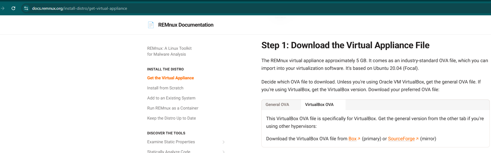

# Malware Sandbox


<br><br>
### Resources used:

https://remnux.org/

https://www.microsoft.com/en-us/evalcenter/download-windows-10-enterprise

https://github.com/mandiant/flare-vm

https://www.virtualbox.org/

## Why this project was important:
This project was important because it taught me how to spin up a malware analysis lab on the go quickly. Using a virtual machine, I can set up a malware analysis lab on any device that can run Oracle VirtualBox. In this lab, I set up two virtual machines that can only communicate with each other.  The two virtual machines I created are FlareVM and Remnux; both are specifically designed for malware analysis. A shared folder between my host and the FlareVM host allows me to move samples onto the host without connecting the virtual machines to the internet. The shared file path also prevents any write events on the virtual machine, keeping my host safer. Remnux offers an essential tool called Inetsim, which acts as a fake DNS server and web server, responding to all network requests from FlareVM. Having access to both allows for the study of any sample. I will use this lab for all the reports in [Malware-Reports](./Malware-Reports/reports.md) and [Disk-Reports](./Disk-Reports/reports.md) sections. 

## Setup process


### FlareVM

### Windows ISO Download

To begin making the malware analysis lab, I downloaded Oracle VirtualBox and ran through the setup with default configurations. I then downloaded a Windows 10 iso file so I can use it to run FlareVM. FlareVM is a modification to the Windows base image that installs many tools for malware analysis.


<br><br>

### FlareVM Preinstall

Once the Windows virtual machine is installed in Oracle VirtualBox, we must prepare Windows for the FlareVM install by disabling the group policies for Windows firewall and threat protection.


<br><br>

### FlareVM Install

After modifying the group policy and taking a snapshot, we run the install PowerShell command, which pulls from the FlareVM repo hosted on GitHub. This will create a pop-up asking if you want to download any additional tools, outside of the default. I added Autopsy for my future disk analysis reports. After the quick pop-up, the process is fully automatic, restarting multiple times to complete its configuration. 


<br><br>

### FlareVM Isolation

Now that FlareVM is fully installed, we need to cut off the device's internet access to prevent malware from spreading and data leaks.


<br><br>


### FlareVM Shared Folder

Finally, I added a shared folder with read-only permission to the virtual machine.


<br><br>


### Remnux

### Remnux Install

Remnux is easier to run as Remnux offers a VirtualBox file. This allows you to import the machine directly into Oracle VirtualBox.




<br><br>

### Remnux Isolation

Now that Remnux is fully installed, we need to cut off the device's internet access to prevent malware from spreading and data leaks.


<br><br>
      

### Remnux Inetsim modification


Once Remnux is running, I configured Inetsim to run as a DNS server, which will allow for better network traffic analysis in the future.


<br><br>

### Inetsim Testing

Now that Remnux Inetsim is configured as I wanted, I need to configure FlareVM to use the Remnux virtual machine as a DNS server.


<br><br>

### Virtual Machines Snapshots

Now that everything is configured, I take another snapshot on both virtual machines to revert to during my malware testing.


```
