# Secure File Transfer Utility
[Server / Decrypter](./decrypter.py).

[Client / Encrypter](./encrypter.py).

### Resources used:

[https://linux.die.net/man/8/iptables](https://gnupg.readthedocs.io/en/latest/)

## Why this project was important:

## Program and code walk-through:

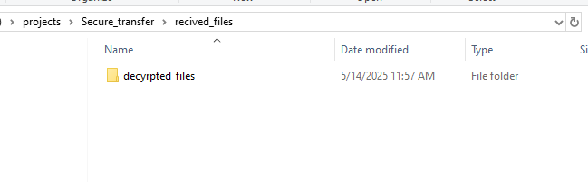
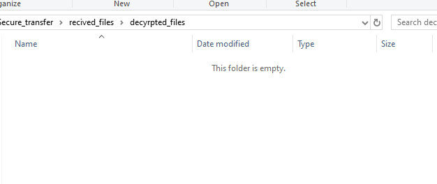
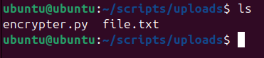
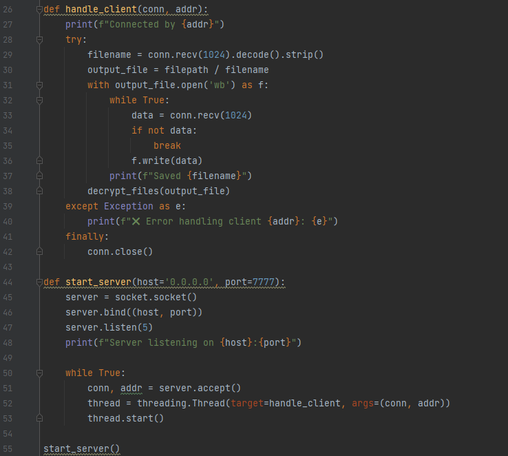
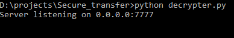
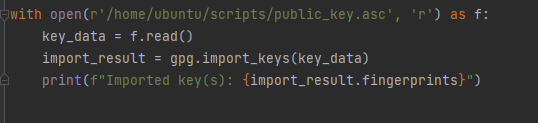
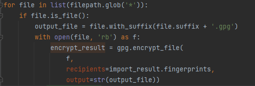
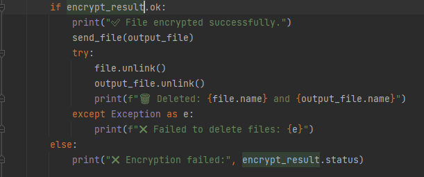
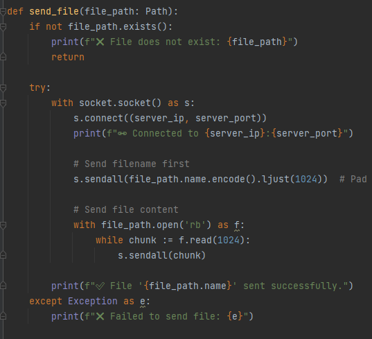
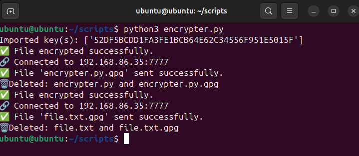
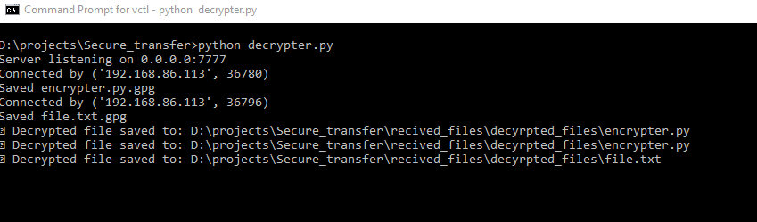
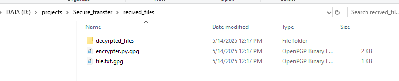
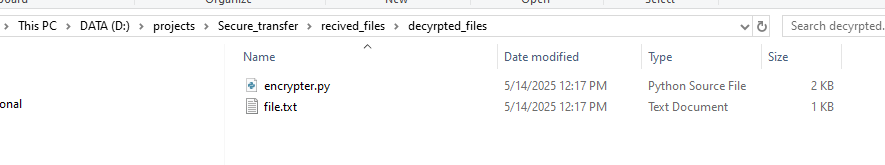
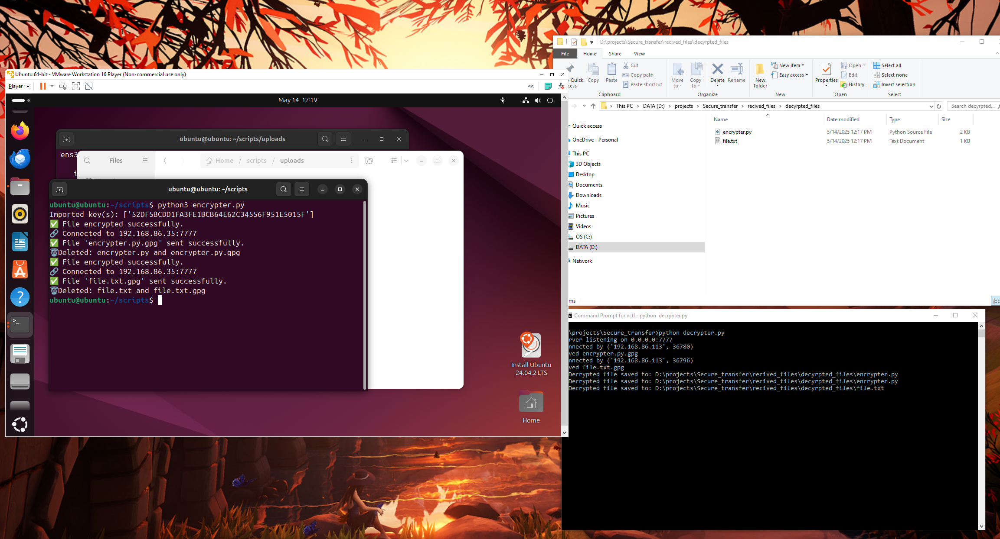
